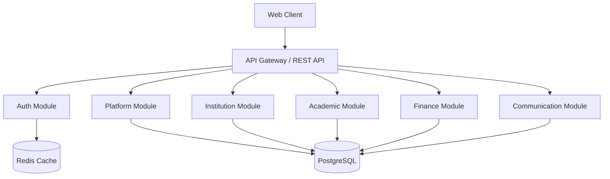
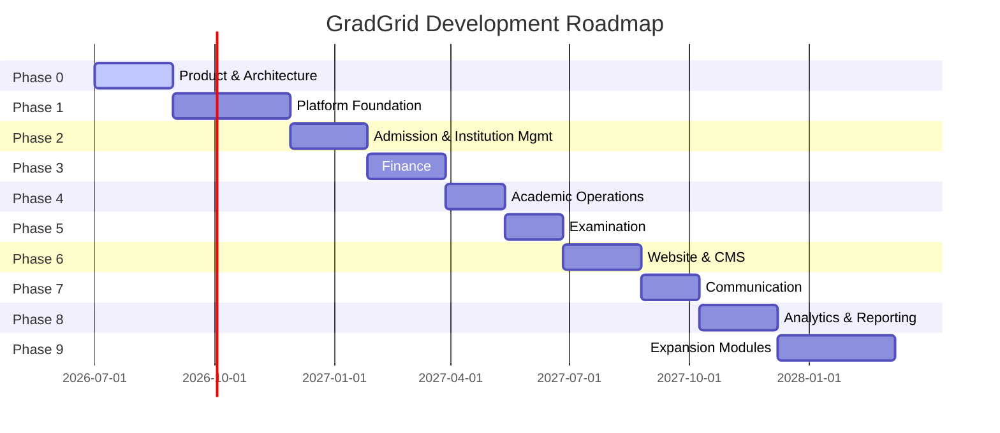

# GradGrid

> **Cloud-Native Multi-Tenant Education ERP SaaS Platform**

GradGrid is a modern, secure, and scalable education ERP platform designed to serve schools, colleges, universities, coaching institutes, and multi-campus educational organizations. Built as a cloud-native SaaS platform — not a single-school ERP — GradGrid supports multi-tenant isolation, role-based access control, and modular feature evolution across a phased roadmap.

---

## Table of Contents

- [Vision & Product Identity](#vision--product-identity)
- [Target Audience](#target-audience)
- [Platform Architecture](#platform-architecture)
- [Tech Stack](#tech-stack)
- [Organizational Hierarchy](#organizational-hierarchy)
- [Core Features (by Phase)](#core-features-by-phase)
- [User Roles & Personas](#user-roles--personas)
- [Repository Structure](#repository-structure)
- [Documentation](#documentation)
- [Security & Compliance](#security--compliance)
- [Getting Started](#getting-started)
- [Development Roadmap](#development-roadmap)
- [Contributing](#contributing)
- [License](#license)

---

## Vision & Product Identity

**Product Vision:** To become the digital operating system for educational institutions by providing a secure, scalable, modular, and intelligent platform that simplifies institutional operations while enabling long-term growth.

### Core Principles

| Priority | Principle |
|----------|-----------|
| 1 | Security |
| 2 | Data Privacy |
| 3 | Simplicity |
| 4 | Scalability |
| 5 | Maintainability |
| 6 | Extensibility |
| 7 | Reliability |
| 8 | User Experience |
| 9 | Performance |
| 10 | Development Velocity |

Supporting principles: **Security by Design**, **Scalability by Default**, **Simplicity First**, **Modularity**, **Extensibility**, **Reliability**, **Transparency**, **Privacy First**.

---

## Target Audience

GradGrid serves a wide range of educational institutions:

| Category | Examples |
|----------|----------|
| Schools | K-12, CBSE, ICSE, State Board, International |
| Colleges | Undergraduate & Postgraduate |
| Universities | Multi-department, multi-campus |
| Coaching Institutes | Exam prep, skill training |
| Training Centers | Vocational, professional development |
| Educational Trusts | Non-profit school groups |
| Educational Societies | Multi-institution managing bodies |
| Multi-Campus Organizations | Groups with multiple institutions |

---

## Platform Architecture

GradGrid follows **Clean Architecture** with **Domain-Driven Design (DDD)** principles. The platform starts as a **Modular Monolith** (MVP) with clear domain boundaries, designed for future migration to **microservices**.



### Architecture Principles

- **Domain-Driven Design** — Modules aligned to business domains
- **SOLID Principles** — Maintainable, testable codebase
- **Clean Architecture** — Separation of concerns across layers
- **API-First Development** — Versioned REST APIs (`/api/v1/`)
- **Repository Pattern** — Data access abstraction
- **Service Layer Pattern** — Business logic isolation
- **Dependency Injection** — Loose coupling
- **Infrastructure Abstraction** — Vendor-agnostic storage, email, messaging
- **Twelve-Factor App** — Cloud-native best practices

---

## Tech Stack

| Layer | Technology | Status |
|-------|-----------|--------|
| **Runtime** | Node.js | Selected |
| **API Framework** | Express.js | Selected |
| **Database** | PostgreSQL 16 | Selected |
| **ORM** | Prisma | Selected |
| **Authentication** | JWT (Access + Refresh Tokens) | Selected |
| **Encryption** | AES-256-GCM | Selected |
| **Frontend** | *To be determined* | Evaluation Phase |
| **Containerization** | Docker | Selected |
| **Orchestration** | Kubernetes-ready | Planned |
| **Deployment** | Cloud-agnostic | Selected |

---

## Organizational Hierarchy

The platform hierarchy is foundational to every feature and data model.

```
GradGrid Platform
        │
        ▼
Organization (Education Group / Trust / Society)
        │
        ▼
Institution (School / College / Coaching / University)
        │
        ▼
Academic Session
        │
        ▼
Users
```

### Key Terminology

| Term | Meaning |
|------|---------|
| **Platform** | Entire GradGrid SaaS |
| **Organization** | Education group managing one or more institutions |
| **Institution** | Individual school, college, or training center |
| **Academic Session** | Annual academic cycle (e.g., 2026–27) |
| **User** | Any authenticated identity |
| **Owner** | Primary administrator of an institution |
| **Platform User** | Internal GradGrid employee |
| **Tenant** | Internal logical isolation boundary |

---

## Core Features (by Phase)

### Phase 0 — Product & Architecture  *(Current)*
- [X] Product Requirements Document (PRD)
- [X] Database Design & ERD
- [X] Information Architecture
- [X] User Personas & Journey Maps
- [X] Architecture Decision Records
- [~] Backend foundation setup
- [~] Frontend foundation setup

### Phase 1 — Platform Foundation
- Organization & Institution Management
- Authentication (Email + Google OAuth)
- RBAC & Permission Engine
- User Management
- Audit Logging
- Platform Admin Portal

### Phase 2 — Admission & Institution Management
- Student Management (CRUD, Import/Export)
- Teacher Management
- Parent Management
- Admissions Pipeline (Enquiry → Enrollment)
- Document Generation (ID Cards, Admission Forms)
- Academic Structure (Classes, Sections, Subjects)

### Phase 3 — Finance
- Fee Structure & Installments
- Fee Collection & Receipts
- Scholarships & Discounts

- Salary Management & Payslips
- Financial Reports

### Phase 4 — Academic Operations
- Attendance (Student & Teacher)
- Timetable Management
- Academic Session Configuration

### Phase 5 — Examination
- Marks Entry & Grading
- Result Generation
- Report Cards & Rank Lists
- Admit Cards

### Phase 6 — Website & CMS
- Website Builder
- Gallery, Blog, Faculty Pages
- SEO & Custom Domain Support

### Phase 7 — Communication
- Email & WhatsApp Messaging
- Templates & Bulk Dispatch
- Scheduled Messages

### Phase 8 — Analytics & Reporting
- Cross-module Reports
- Custom Report Builder
- Export Centre

### Phase 9 — Expansion Modules
- Student & Parent Portals *(Future)*
- Library Management
- Hostel Management
- Transport Management
- AI-powered Insights *(Future)*

*Features beyond MVP scope display a **Coming Soon** state in the UI where appropriate.*

---

## User Roles & Personas

### Platform Roles (Internal GradGrid)

| Role | Description |
|------|-------------|
| Platform Super Admin | Complete platform control |
| Platform Admin | Operations management |
| Support Executive | Institution support |
| Customer Success | Onboarding & training |
| Sales Executive | Organization onboarding |
| Finance Manager | Subscription & billing *(Future)* |
| Developer | Internal engineering access |
| DevOps Engineer | Infrastructure management |
| Security Auditor | Read-only security & audit access |

### Institution Roles

| Role | Description | Persona |
|------|-------------|---------|
| Institution Owner | Full institution control | **Rajesh Malhotra** |
| Institution Admin | Administrative operations | **Anita Sharma** |
| Teacher | Teaching & academic tasks | **Vikram Nair** |
| Accountant | Fees & salary management | **Priya Iyer** |
| Receptionist | Admissions & front desk | **Meena Pillai** |
| HR | Staff management | **Suresh Kadam** |
| Librarian | Library operations | — |
| Custom Role | Institution-defined | — |
| Student *(Future)* | Self-service portal | **Arjun Singh** |
| Parent *(Future)* | Parent portal | **Neha Agarwal** |

### Permission Matrix

**Legend:** Full -- Full Access | Partial -- Limited Access | View -- View Only | Custom -- Configurable per Institution | -- -- No Access

| Module | Platform Super Admin | Institution Owner | Institution Admin | Teacher | Accountant | Librarian | Receptionist | HR | Student* | Parent* |
|--------|:---:|:---:|:---:|:---:|:---:|:---:|:---:|:---:|:---:|:---:|
| Organization Management | Full | -- | -- | -- | -- | -- | -- | -- | -- | -- |
| Institution Settings | Full | Full | Custom | -- | -- | -- | -- | -- | -- | -- |
| User Management | Full | Full | Custom | -- | -- | -- | -- | Partial | -- | -- |
| Role & Permissions | Full | Full | Custom | -- | -- | -- | -- | -- | -- | -- |
| Academic Session | Full | Full | Custom | View | -- | -- | View | -- | View | View |
| Student Management | Full | Full | Custom | Partial | View | View | Custom | -- | View | View |
| Teacher Management | Full | Full | Custom | View | View | -- | -- | Custom | -- | -- |
| Parent Management | Full | Full | Custom | View | -- | -- | Custom | -- | -- | View |
| Admissions | Full | Full | Custom | -- | -- | -- | Custom | -- | -- | -- |
| Classes & Sections | Full | Full | Custom | View | -- | -- | -- | -- | View | View |
| Attendance | Full | Full | Custom | Custom | -- | -- | -- | -- | View | View |
| Fees | Full | View | View | -- | Full | -- | -- | -- | View | View |
| Salary | Full | View | View | View (Own) | Full | -- | -- | Custom | -- | -- |
| Library | Full | View | Custom | Custom | -- | Full | -- | -- | View | View |
| Examination | Full | Full | Custom | Custom | -- | -- | -- | -- | View | View |
| Reports | Full | Full | Custom | Custom | Custom | Custom | Custom | Custom | View | View |
| Website CMS | Full | Full | Custom | -- | -- | -- | -- | -- | -- | -- |
| Communication | Full | Full | Custom | Custom | -- | -- | Custom | -- | View | View |
| Audit Logs | Full | Custom | Custom | View (Own) | View (Own) | View (Own) | View (Own) | View (Own) | -- | -- |
| Sensitive Data | Custom | Custom | Custom | -- | -- | -- | -- | Custom | -- | -- |
| Platform Analytics | Full | -- | -- | -- | -- | -- | -- | -- | -- | -- |

*\*Student and Parent access is planned for a future phase.*

---

## Repository Structure

```
gradgrid/
├── backend/              # Node.js + Express backend (in development)
│   └── .gitkeep
├── frontend/             # Frontend application (in development)
│   └── .gitkeep
├── docs/                 # Complete product & technical documentation
│   ├── GradGrid_PRD.md                           # Product Requirements Document
│   ├── GradGrid_Database_Design.md               # Full PostgreSQL schema design
│   ├── GradGrid_Information_Architecture.md      # Navigation & page structure
│   ├── GradGrid_Constitution_Documentation.md    # Governing documentation standards
│   ├── GradGrid_ADR_TDR_INDEX.md                 # Architecture Decision Record index
│   ├── GradGrid_User_Personas.md                 # 7 MVP + 2 Future user personas
│   ├── GradGrid_User_Journey_Maps.md             # 10 end-to-end user journeys
│   ├── GradGrid_ERD.mermaid                      # Entity-Relationship Diagram
│   └── Instructions.md                           # AI-assisted doc generation guides
├── README.md              # This file
```

---

## Documentation

The documentation covers the full product lifecycle. The following hierarchy outlines completed and planned documentation:

### Documentation Hierarchy

1. [X] Vision & Goals
2. [X] Product Requirements Document (PRD)
3. [~] Software Requirements Specification (SRS)
4. [X] User Personas
5. [X] User Journey Maps
6. [~] Feature Prioritization (MoSCoW)
7. [X] Information Architecture
8. [~] Domain Model
9. [X] Database Design
10. [~] API Specification
11. [X] RBAC & Permission Matrix
12. [~] UI/UX Design System
13. [~] Security Architecture
14. [~] Infrastructure Architecture
15. [~] Deployment Strategy

### Key Documents

| Document | Description |
|----------|-------------|
| Documentation Constitution | Foundational standards governing all documentation |
| Product Requirements Document (PRD) | Complete functional and non-functional requirements |
| Database Design | Full PostgreSQL schema with 40+ tables across 15 domains |
| Information Architecture | Portal navigation, page hierarchy, and URL structures |
| Entity-Relationship Diagram (ERD) | Visual database schema in Mermaid format |
| User Personas | 9 detailed personas covering all user types |
| User Journey Maps | 10 end-to-end journey maps for MVP workflows |
| Architecture & Technical Decision Record (ADR/TDR) Index | Registry of architecture and technical decisions |

### ADR/TDR System

Architecture decisions are tracked as numbered records covering:
- **Product** — Business decisions, scope, roadmap
- **Architecture** — System design, DDD, Clean Architecture
- **Security** — Encryption, authentication, authorization
- **Database** — Engine, schema, migrations
- **Infrastructure** — Docker, Kubernetes, Cloud
- **Backend** — Node.js, Express, Prisma, Validation
- **Frontend** — Framework, state management, routing
- **API** — REST, versioning, pagination

---

## Security & Compliance

### Authentication
- **JWT Access Tokens** — Short-lived, stored only in application memory
- **Refresh Tokens** — Rotating with family-based reuse detection
- **HTTPOnly Cookies** — Secure token transmission
- **Multi-Factor Authentication** *(Planned)*

### Authorization
- **Role-Based Access Control (RBAC)** with fine-grained permissions
- **Permission Registry** — All permissions declared centrally
- **Custom Roles** — Institutions can define roles beyond defaults
- **Data Scope** — Every query scoped by institution

### Sensitive Data Protection
- **AES-256-GCM** encryption for personal identifiers (Aadhaar, PAN, etc.)
- **Envelope Encryption** with separate Data Encryption Keys (DEKs)
- **Masked by default** — Sensitive values hidden unless explicitly revealed
- **Full audit logging** on every decrypt, export, or modification

### Audit Logging
Two independent audit systems:
- **Platform Audit Logs** — Internal GradGrid operations
- **Institution Audit Logs** — Customer-side actions (CRUD, auth, imports, exports, sensitive data access, permission changes, document generation, communication, configuration changes)

### Data Privacy
- **Tenant isolation** — Complete data segregation between institutions
- **Least-privilege access** — Every role has minimum required permissions
- **Soft deletion** — Records preserved before permanent archival
- **Data retention policies** *(Planned)*

---

## Getting Started

### Prerequisites
- **Node.js** >= 18 LTS
- **PostgreSQL** 16
- **Docker** (recommended for development)
- **npm** or **yarn**

### Development Setup

```bash
# Clone the repository
git clone https://github.com/your-org/gradgrid.git
cd gradgrid

# Backend setup (coming soon)
cd backend
npm install
cp .env.example .env    # Configure your environment
npx prisma migrate dev  # Run database migrations
npm run dev             # Start development server

# Frontend setup (coming soon)
cd ../frontend
npm install
npm run dev             # Start frontend development server
```

> **Note:** The backend and frontend are currently in the architectural planning phase. Implementation will begin following Phase 0 completion.

---

## Development Roadmap



### Current Status: **Phase 0 — Product & Architecture**

The project is currently in the architectural planning and documentation phase. The complete documentation suite has been authored, and implementation of the backend and frontend codebases is about to begin.

---

## Contributing

GradGrid follows established engineering principles and documentation standards. Before contributing:

1. Review the GradGrid Documentation Constitution for governing documentation standards
2. Consult the ADR/TDR Index for existing architecture decisions
3. Follow **Domain-Driven Design** and **Clean Architecture** patterns
4. Ensure API-first development with versioned endpoints

---

## License

[License information to be added]

---

<p align="center">
  <strong>GradGrid</strong> — The Digital Operating System for Educational Institutions
</p>
